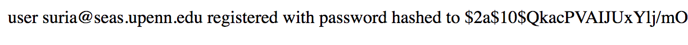
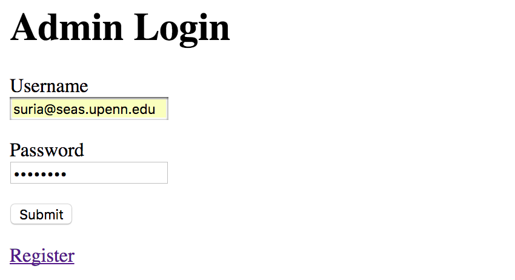

# Mongo Login Example

In one tab, start `mongod` and keep it running

In another tab, cd to this project, run `npm install` and then run `node app.js`

`localhost:3000/register`

`localhost:3000/login`

`localhost:3000/protected`

`localhost:3000/logout`

